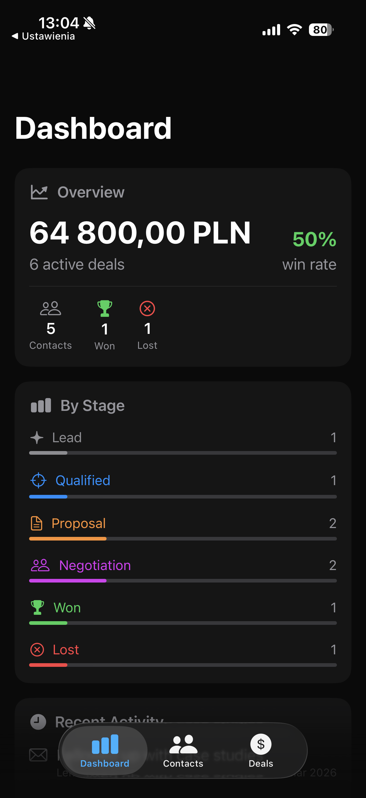
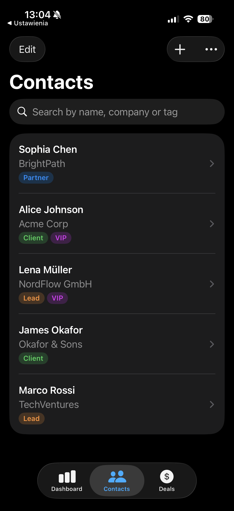
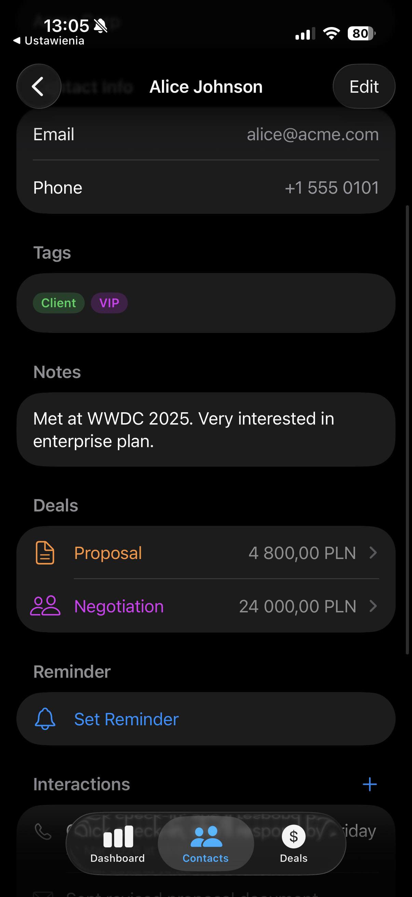
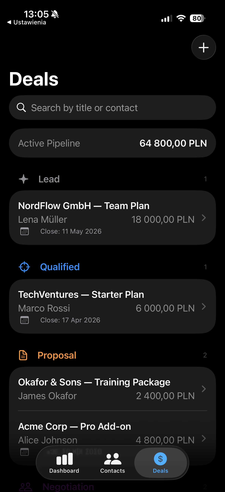

# CRM — Personal CRM for iOS

A lightweight, mobile-first personal CRM to manage contacts, interactions, deals, and follow-up reminders. Built entirely for iPhone with a clean native feel.

> **Vibe-coded with [Claude Code](https://claude.ai)** by Anthropic.
---

## Screenshots

<table>
  <tr>
    <td></td>
    <td></td>
    <td></td>
    <td></td>
  </tr>
  <tr>
    <td align="center">Dashboard</td>
    <td align="center">Contacts</td>
    <td align="center">Contact Detail</td>
    <td align="center">Deals</td>
  </tr>
</table>

---

## Features

- **Contacts** — Add, edit, search, and tag people you know
- **Interaction Log** — Record calls, emails, meetings, and notes per contact
- **Tags** — Color-coded labels (Lead, Client, VIP, etc.) with multi-select picker
- **Follow-up Reminders** — Schedule local notifications to never miss a follow-up
- **Deals / Pipeline** — Track deals through stages: Lead → Proposal → Won/Lost
- **Dashboard** — Pipeline value, win rate, stage breakdown, upcoming reminders, recent activity
- **iCloud Sync** — Data syncs across all your Apple devices via CloudKit *(requires paid Apple Developer account)*

---

## Tech Stack

| Technology | Role |
|---|---|
| **Swift 6.2** | Language — strict concurrency, modern async/await |
| **SwiftUI** | Declarative UI, iOS 26+ APIs |
| **SwiftData** | Local persistence with `@Model`, `@Query`, automatic migrations |
| **CloudKit** | iCloud sync via `ModelConfiguration(cloudKitDatabase: .automatic)` |
| **UserNotifications** | Local push notifications for reminders |

No third-party dependencies. Zero.

---

## Environment

| | |
|---|---|
| **Platform** | iOS 26.0+ |
| **Language** | Swift 6.2 |
| **IDE** | Xcode 26 |
| **AI Assistant** | [Claude Code](https://claude.ai/claude-code) (claude-sonnet-4-6) by Anthropic |
| **Vibe** | 100% |

---

## How it was built

This app was **vibe-coded** — meaning the entire codebase was generated, iterated on, and debugged in conversation with **Claude Code**, Anthropic's AI-powered terminal coding tool.

The process:
1. Described the app idea in plain English
2. Claude Code planned the architecture, generated the SwiftData models, SwiftUI views, and services
3. Each feature was added incrementally: Contacts → Interactions → Tags → Reminders → Deals → Dashboard → CloudKit
4. Claude Code built after each phase, caught warnings and errors, and fixed them
5. A living `Journal.md` was maintained throughout — documenting decisions, gotchas, and lessons learned

The result is production-quality Swift code following Apple's Human Interface Guidelines, modern SwiftUI patterns, and strict concurrency rules — written in a single session.

---

## Project Structure

```
CRM/
  Models/
    Contact.swift          — @Model: name, company, email, phone, notes, reminder
    Interaction.swift      — @Model: type, date, summary, contact
    Tag.swift              — @Model: name, color, contacts (many-to-many)
    Deal.swift             — @Model: title, value, stage, close date, contact
  Features/
    Contacts/
      ContactsView.swift         — list + search (name, company, tag)
      ContactDetailView.swift    — full contact info, deals, reminder, interactions
      ContactFormView.swift      — add / edit (dual-mode with optional contact param)
      InteractionFormView.swift  — log / edit interaction
      ReminderFormView.swift     — set / edit / clear reminder
    Tags/
      TagPickerView.swift        — multi-select, create inline, swipe to delete
      TagChipView.swift          — reusable colored capsule badge
    Deals/
      DealsView.swift            — grouped by stage, pipeline value, search
      DealDetailView.swift       — stage, value, contact link, close date, notes
      DealFormView.swift         — add / edit with contact picker
    Dashboard/
      DashboardView.swift        — overview cards: pipeline, stages, reminders, activity
  Services/
    NotificationService.swift    — UNUserNotificationCenter wrapper (@MainActor)
  RootView.swift                 — TabView (Dashboard · Contacts · Deals)
  CRMApp.swift                   — ModelContainer with CloudKit config
```

---

## Running Locally

1. Clone the repo
2. Open `CRM.xcodeproj` in Xcode
3. Select your simulator or device
4. Build & run (`⌘R`)

> CloudKit sync requires an Apple Developer Program membership and iCloud capability enabled in Signing & Capabilities. Without it, the app falls back to local storage automatically.

---

## License

MIT — do whatever you want with it.
